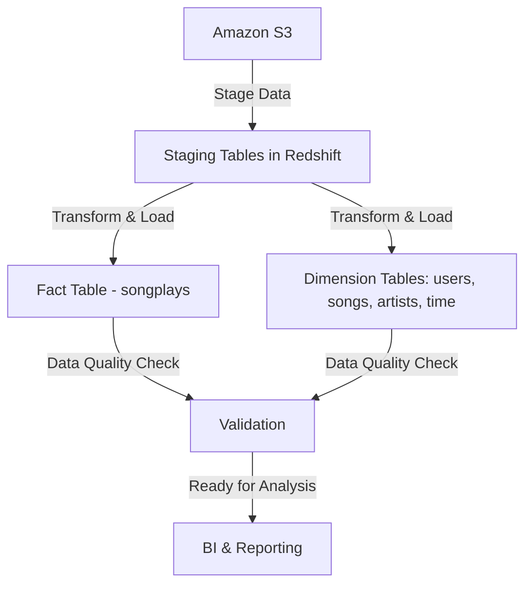

# **Data Pipelines with Apache Airflow & Amazon Redshift**  

  

## **📌 Project Overview**  
This project implements an **ETL (Extract, Transform, Load) data pipeline** using **Apache Airflow** to orchestrate data workflows and **Amazon Redshift** as the data warehouse.

The pipeline:  
- **Extracts** raw data from **Amazon S3**  
- **Loads** it into staging tables in **Redshift**  
- **Transforms** the data into fact and dimension tables for analytics  
- **Validates** the data quality

## **📊 Pipeline Architecture**  


## **🛠️ Tech Stack**  
✅ **Apache Airflow** - Orchestration  
✅ **Amazon Redshift** - Data Warehouse  
✅ **Amazon S3** - Data Storage  
✅ **Docker** - Containerization  
✅ **Python** - Data Processing  
✅ **SQL** - Querying  

## **📂 Project Structure**  
```plaintext
DataPipelines/
│── airflow/
│   ├── dags/
│   │   ├── final_project.py  # DAG defining the workflow
│   ├── plugins/
│   │   ├── helpers/sql_queries.py  # SQL Queries for ETL
│   │   ├── operators/
│   │   │   ├── stage_redshift.py  # Loads data from S3 to Redshift
│   │   │   ├── load_fact.py  # Populates fact table
│   │   │   ├── load_dimension.py  # Populates dimension tables
│   │   │   ├── data_quality.py  # Ensures data integrity
│── create_tables.sql  # SQL script for table creation
│── docker-compose.yaml  # Airflow setup
│── set_connections_and_variables.sh  # Environment setup
```

## **🚀 Installation & Setup**  
### **1️⃣ Install Dependencies**  
Ensure you have **Docker** and **AWS CLI** installed.

```bash
# Clone the repository
git clone https://github.com/your-repo/DataPipelines.git
cd DataPipelines
```

### **2️⃣ Set Up AWS Credentials**  
Modify `set_connections_and_variables.sh` with your **AWS_ACCESS_KEY** and **AWS_SECRET_KEY**, then run:
```bash
bash set_connections_and_variables.sh
```

### **3️⃣ Start Apache Airflow**  
Run Docker to start **Airflow UI**:
```bash
docker-compose up -d
```
Then, access the **Airflow UI** at:  
[http://localhost:8080](http://localhost:8080)

### **4️⃣ Create Redshift Tables**  
Manually execute:
```sql
\i create_tables.sql
```
Or run it from the **Query Editor in Redshift**.

### **5️⃣ Trigger the Pipeline in Airflow**  
In the Airflow UI, trigger the DAG:  
📍 DAG Name: `final_project`

## **🔄 Workflow Execution**  
```mermaid
gantt
title ETL Pipeline Execution
dateFormat  HH:mm\section Staging
S3 to Redshift  :done, 10:00, 10min
\section Transform & Load
Load Fact Table  :active, 10:10, 15min
Load Dimension Tables :active, 10:25, 10min
\section Validation
Data Quality Check  :active, 10:35, 5min
```

## **📌 Data Model (Star Schema)**  
```mermaid
graph TD;
    A[staging_events] -->|Transform| B[songplays (fact table)];
    A[staging_songs] -->|Transform| B;
    B --> C[users (dim)];
    B --> D[songs (dim)];
    B --> E[artists (dim)];
    B --> F[time (dim)];
```

## **🔍 SQL Queries Used in the Pipeline**  
### **1️⃣ Fact Table: `songplays`**  
```sql
SELECT
    md5(events.sessionid || events.start_time) AS songplay_id,
    events.start_time,
    events.userid,
    events.level,
    songs.song_id,
    songs.artist_id,
    events.sessionid,
    events.location,
    events.useragent
FROM staging_events events
LEFT JOIN staging_songs songs
ON events.song = songs.title
AND events.artist = songs.artist_name;
```

### **2️⃣ Dimension Table: `users`**  
```sql
SELECT DISTINCT userid, firstname, lastname, gender, level
FROM staging_events
WHERE page='NextSong';
```

## **📈 Monitoring & Debugging**  
### **Check DAG Status**  
```bash
airflow dags list
airflow dags trigger final_project
airflow tasks list final_project
airflow tasks test final_project Stage_events 2024-02-11
```
### **Check Redshift Data**  
```sql
SELECT COUNT(*) FROM songplays;
SELECT * FROM songplays LIMIT 10;
```

## **📜 License**  
This project is licensed under the **MIT License**.

## **💡 Future Improvements**  
✅ Automate table creation in Airflow  
✅ Improve logging and monitoring with Airflow Metrics  
✅ Extend pipeline with additional data sources  

---

**Made with ❤️ using Apache Airflow & AWS Redshift** 🚀

