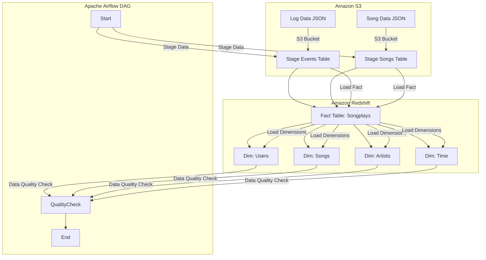
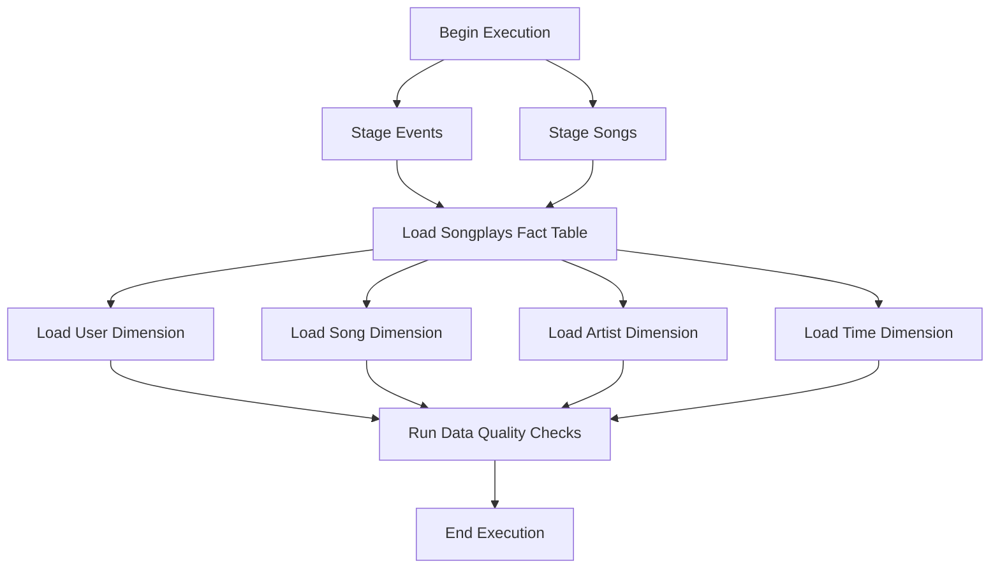

# 🎵 Sparkify Data Pipeline with Apache Airflow


> **Automating an ETL pipeline with Apache Airflow, S3, and Redshift for music streaming data processing.**

---

## 📜 Introduction
Sparkify, a music streaming company, aims to **automate its data pipeline** for better user data analysis.  
This project uses **Apache Airflow** to **orchestrate an ETL pipeline**, **Amazon S3** as the data source, and **Amazon Redshift** as the data warehouse.

---

## 📌 Project Architecture



# 📂 Directory & Files
```🛠️ Project Structure

.
├── dags/
│   ├── final_project.py  # Main DAG definition
├── plugins/
│   ├── operators/
│   │   ├── stage_redshift.py    # Staging data from S3 to Redshift
│   │   ├── load_fact.py         # Loading fact table
│   │   ├── load_dimension.py    # Loading dimension tables
│   │   ├── data_quality.py      # Data quality checks
│   ├── helpers/
│   │   ├── sql_queries.py       # SQL queries for data transformation
├── create_tables.sql            # SQL script for Redshift table creation
├── docker-compose.yaml          # Local Airflow environment setup
└── README.md
```

# ⚡ Apache Airflow DAG

Graph View
Task Dependencies



# 🛠️ Installation

🔹 Requirements

    Python 3.7+
    Docker (for local Airflow execution)
    AWS CLI (to connect to S3 and Redshift)

🔹 Setup Environment
🔹 Start Docker with Airflow

docker-compose up -d

🔹 Set AWS Variables in Airflow

airflow connections add aws_credentials \
    --conn-type aws \
    --conn-extra '{"aws_access_key_id": "YOUR_ACCESS_KEY", "aws_secret_access_key": "YOUR_SECRET_KEY"}'

# 📂 Module Breakdown


1️⃣ StageToRedshiftOperator

📌 Loads JSON data from S3 into Redshift using COPY

copy_sql = f"""
    COPY {self.table}
    FROM '{s3_path}'
    IAM_ROLE '{self.iam_role}'
    FORMAT AS JSON '{self.json_format}';
"""

2️⃣ LoadFactOperator

📌 Loads data into the fact table

INSERT INTO songplays (playid, start_time, userid, ...)
SELECT DISTINCT md5(events.sessionid || events.start_time), ...
FROM staging_events events
LEFT JOIN staging_songs songs ON events.song = songs.title;

3️⃣ LoadDimensionOperator

📌 Supports truncate-insert

if self.truncate_insert:
    redshift.run(f"DELETE FROM {self.table}")
redshift.run(self.sql_query)

4️⃣ DataQualityOperator

📌 Performs data integrity checks in Redshift

for check in self.sql_checks:
    sql_query, expected_value = check
    records = redshift.get_records(sql_query)
    if records[0][0] < expected_value:
        raise ValueError(f"Test failed: {sql_query}")


# 🔬 Testing & Debugging

✅ Test Airflow DAG

airflow tasks test final_project Stage_events 2024-02-01

✅ Debug Logs

docker logs -f airflow_scheduler

✅ Verify Redshift

SELECT COUNT(*) FROM songplays;

# 🖥️ Expected Output

[INFO] StageToRedshiftOperator - Copying data from S3 to Redshift...
[INFO] LoadFactOperator - Inserting data into fact table...
[INFO] LoadDimensionOperator - Inserting data into dimension tables...
[INFO] DataQualityOperator - Running data quality checks...
[INFO] DAG Execution Completed Successfully!

# 📈 Project Benefits

✅ Automation → The entire ETL process is managed by Airflow
✅ Scalability → AWS Redshift handles large-scale data
✅ Reliability → Data quality tests ensure integrity
✅ Modularity → Easily extendable with new sources and transformations
📌 Conclusion

This project demonstrates how Apache Airflow can manage a complex data pipeline with AWS S3 and Redshift.
The workflow automates data ingestion, transformation, and validation, enabling efficient analytics.

# 🚀 Next Steps:

    Integrate Amazon Athena for ad-hoc analysis
    Optimize SQL queries for better performance
    Build a dashboard with Amazon QuickSight to visualize data insights

# 🔗 Useful Links

    Apache Airflow Documentation
    Amazon Redshift Best Practices
    S3 Data Management

# 🎯 Built with ❤️ for Sparkify 🎵
Author: Riccardo Scaringi
📅 Last Updated: February 2025
